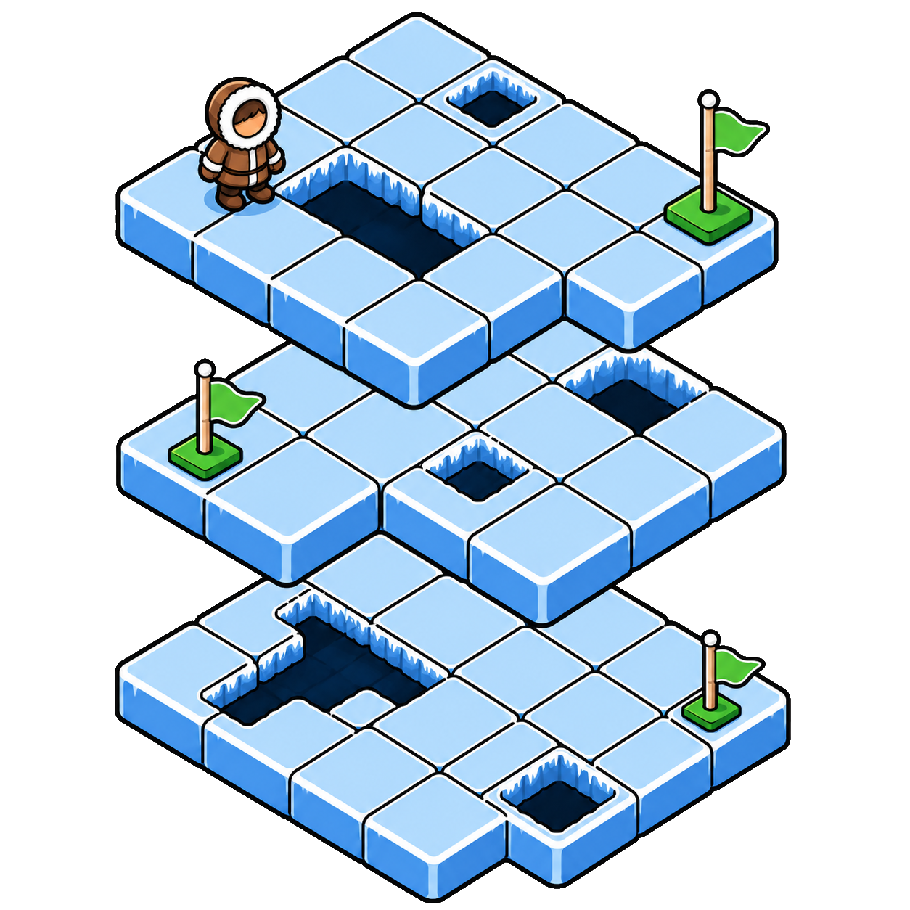
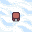
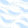
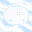
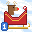
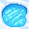
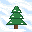

# Procedural Frozen Lake

<p align="center"></p>

A Gymnasium environment that extends Frozen Lake with **procedurally generated maps**.

`Procedural-FrozenLake-v1` optionally supports:

- **Random lake shapes** — Each map is a lake on a fixed canvas with uneven, jagged edges instead of a plain rectangle. Size is picked within your `min_width`/`max_width` and `min_height`/`max_height` bounds and placed at a random spot on the grid.
- **Tree tiles (`T`)** — Impassable tiles that block movement. Every map gets a tree border around the lake; sprinkle more inside with `tree_prob`.
- **Mirror ice tiles (`M`)** — Slippery ice that makes you slide like classic FrozenLake. Sprinkle them with `glare_prob` instead of flipping a global slippery switch.
- **Warp sleigh tiles (`W`)** — Paired tiles that teleport you to each other when you step on one. Add them with `sleigh_pair_count` (two `W` tiles per pair).
- **Multiple start tiles (`S`)** — Pin one spot, pass a list, or sample placement with `start_pos` / `start_pos_prob`.
- **Multiple goal tiles (`G`)** — Same for goals with `goal_pos` / `goal_pos_prob`.
- **Different rewards per goal** — Each goal tile can pay its own amount, either sampled between bounds or set explicitly.
- **Fresh maps without rebuilding** — Pass `options={"regenerate_map": True}` on `reset()` to draw a new layout in the same env instance.
- **Map layout in `info`** — `emit_map=True` puts the current board in `info["map"]` on every reset and step.
- **Optimal Q-values in `info`** — `emit_q_star=True` puts the optimal Q-table in `info["q_star"]` on every reset and step.
- **Hidden tiles until explored** — Fog of war is on by default: unvisited tiles show as `?`. Bumping a tree or warping through a sleigh reveals those tiles; what you've seen stays visible until the map changes. Turn off with `fog_of_war=False`.
- **Shuffled state numbers** — `permute_obs=True` randomly relabels observations so agents can't memorize that state 12 always means "row 2, column 4."
- **Shuffled action numbers** — `permute_actions=True` does the same for the four movement actions. Both permutations are stored in `info["map"]`.

## News

- **2026-07-07 — v0.4.0 is out!** — Observation and action permutations (`permute_obs` / `permute_actions`): state indices and action ids are relabeled with random permutations sampled alongside the map, so agents can't rely on canonical numbering. Also: new tile letters (`T`/`M`/`W`), fog of war on by default, `env.P` carries exact rewards, Q\* discounted by `q_star_gamma`, constructor validation, lake envelope placement. See [CHANGELOG.md](CHANGELOG.md).
- **2026-07-07 — v0.3.0** — Variable map boundaries (land shorelines, glare ice, ice floe warps), fixed `max_width × max_height` canvas, tile-driven slipperiness. See [CHANGELOG.md](CHANGELOG.md).

See [CHANGELOG.md](CHANGELOG.md) for the full release history.

## Install

```bash
pip install procedural-frozenlake
```

For development:

```bash
git clone https://github.com/micahr234/procedural-frozenlake.git
cd procedural-frozenlake
source scripts/install.sh
```

## Quick start

Importing the package registers the environment with Gymnasium:

```python
import gymnasium as gym
import procedural_frozenlake  # registers Procedural-FrozenLake-v1

env = gym.make(
    "Procedural-FrozenLake-v1",
    map_seed=0,
    emit_map=True,
    emit_q_star=True,
    step_penalty=-0.01,
)
obs, info = env.reset(seed=1)
print(info["map"])    # JSON string with board layout and goal rewards
print(info["q_star"]) # optimal Q-values for the current state

for _ in range(100):
    action = env.action_space.sample()
    obs, reward, terminated, truncated, info = env.step(action)
    if terminated or truncated:
        obs, info = env.reset()

env.close()
```

See [`examples/random_rollout.ipynb`](examples/random_rollout.ipynb) for a tutorial notebook: multi-episode rollout, multiple starts and goals with per-goal rewards, fog-of-war, Q\* labels, and an embedded replay video.

## Environment

**ID:** `Procedural-FrozenLake-v1`

Maps are generated lazily on the first `reset()`, not during construction. **By default, the same map is reused across episodes** — only pass `options={"regenerate_map": True}` when you want a fresh layout. `reset(seed=…)` still controls episode-level randomness (e.g. start sampling); it does not regenerate the map unless you ask.

### Tile legend

| Icon | Tile | Name | Behavior |
|:----:|:----:|------|----------|
|  | `S` | Start | Walkable; deterministic movement |
|  | `F` | Frozen | Normal safe ice; deterministic movement |
|  | `M` | Mirror ice | Slippery ice (stochastic sliding when standing on it) |
|  | `W` | Warp sleigh | Warp to paired sleigh on entry; both tiles in a pair share the same numbered badge |
|  | `H` | Hole | Terminal — fall through |
|  | `G` | Goal | Terminal — success; reward shown in badge, bow tinted yellow (low) to green (high) |
|  | `T` | Tree | Impassable shoreline and optional interior patches |

### Constructor parameters

**Map generation**

| Parameter | Default | Description |
|-----------|---------|-------------|
| `map_seed` | `None` | Seed for map generation (independent of reset seed) |
| `fixed_map` | `None` | Fixed layout (list of row strings or dict with `board`/`rewards`); disables random generation and cannot be combined with `start_pos`/`goal_pos` options |
| `min_width`, `max_width` | `3`, `8` | Width bounds for the sampled lake envelope; all playable tiles fit inside it (canvas width = `max_width`) |
| `min_height`, `max_height` | `3`, `8` | Height bounds for the sampled lake envelope; all playable tiles fit inside it (canvas height = `max_height`) |
| `hole_prob` | `0.2` | Probability a tile becomes a hole `H` |
| `tree_prob` | `0.0` | Probability a frozen ice tile becomes an interior tree `T` after the lake is carved |
| `glare_prob` | `0.0` | Probability a frozen (`F`) tile becomes mirror ice `M` |
| `sleigh_pair_count` | `0` | Number of sleigh warp pairs (`2 × count` `W` tiles) |
| `start_pos`, `start_pos_prob` | `None`, `None` | Fixed start tile(s) or probability of placing starts; explicit positions raise an error when they can't be placed on lake ice |
| `goal_pos`, `goal_pos_prob` | `None`, `None` | Fixed goal tile(s) or probability of placing goals; explicit positions raise an error when they can't be placed on lake ice |
| `min_hops` | `3` | Minimum shortest-path length from start to goal |
| `max_tries` | `10_000` | Generation attempts before giving up with an error |

**Dynamics and rewards**

| Parameter | Default | Description |
|-----------|---------|-------------|
| `slippery_success_rate` | `1/3` | Intended-direction success rate on mirror ice `M` |
| `step_penalty` | `0.0` | Added to every step reward (e.g. `-0.01`); baked into `env.P` transition rewards |
| `goal_reward_low`, `goal_reward_high` | `1.0`, `1.0` | Per-goal reward sampling bounds |

**Supervision signals in `info`**

| Parameter | Default | Description |
|-----------|---------|-------------|
| `emit_map` | `False` | Inject map layout in `info["map"]` on every `reset()` and `step()` |
| `emit_q_star` | `False` | Inject optimal Q-values in `info["q_star"]` (zero at terminal states) |
| `q_star_gamma` | `0.999` | Discount for Q\* value iteration over `env.P` (whose rewards include `step_penalty`), so Q\* is the optimal value of the live MDP and prefers shorter paths |

**Relabeling**

| Parameter | Default | Description |
|-----------|---------|-------------|
| `permute_obs` | `False` | Relabel observations with a random permutation of canvas state indices, sampled with the map |
| `permute_actions` | `False` | Relabel the four actions with a random permutation, sampled with the map |

**Rendering**

| Parameter | Default | Description |
|-----------|---------|-------------|
| `fog_of_war` | `True` | Hide unvisited tiles as `?` (trees revealed when visited or bumped); set `False` to render the full map |
| `render_mode` | `None` | Standard Gymnasium render mode: `"ansi"`, `"human"`, or `"rgb_array"` |

### Reset options

Pass `options={"regenerate_map": True}` to `reset()` to generate a new map. Not available when `fixed_map` is set.

## Contributing

See [CONTRIBUTING.md](CONTRIBUTING.md).

## License

GNU General Public License v3.0 — see [LICENSE](LICENSE).
